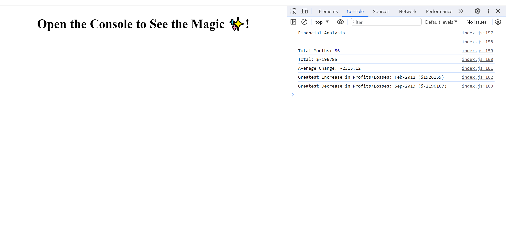

# Console-Finances

This script performs a basic financial analysis using a dataset of monthly financial data. It calculates the total number of months, the net total amount of profit/losses, the average change in profit/losses, and identifies the greatest increase and decrease in profits along with their corresponding dates.

## How to Use

1. Clone the repository or download the `financial_analysis.js` file.

2. Open a terminal and navigate to the directory where the script is located.

3. Run the script using Node.js:

    ```bash
    node financial_analysis.js
    ```

4. The script will output the financial analysis results in the console.

## Output

The script will display the following information:

- Total Months: [total number of months]
- Total: $[net total amount of profit/losses]
- Average Change: $[average change in profit/losses]
- Greatest Increase in Profits/Losses: [month-year] ($[amount])
- Greatest Decrease in Profits/Losses: [month-year] ($[amount])

## Mock up

